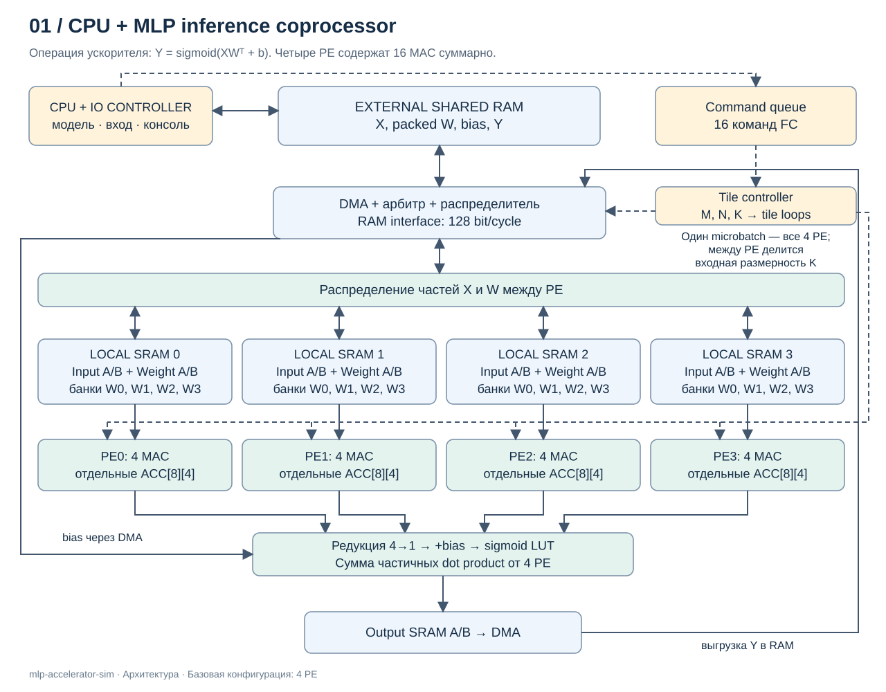
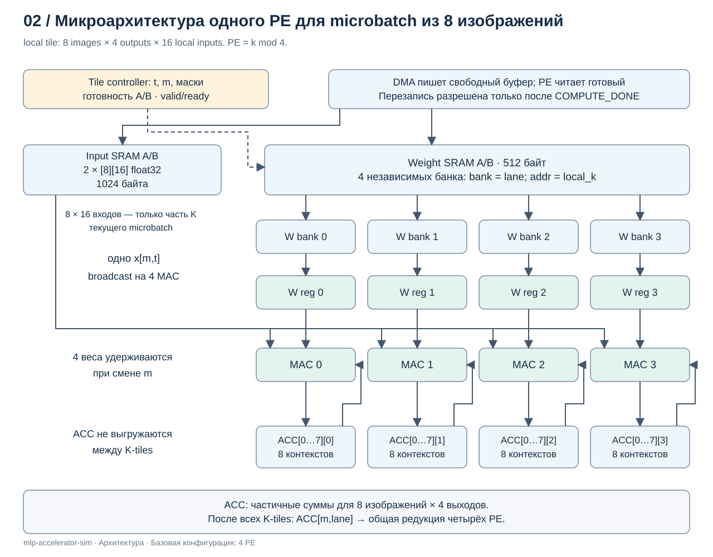
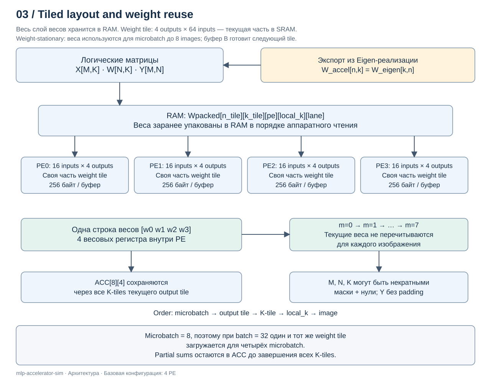
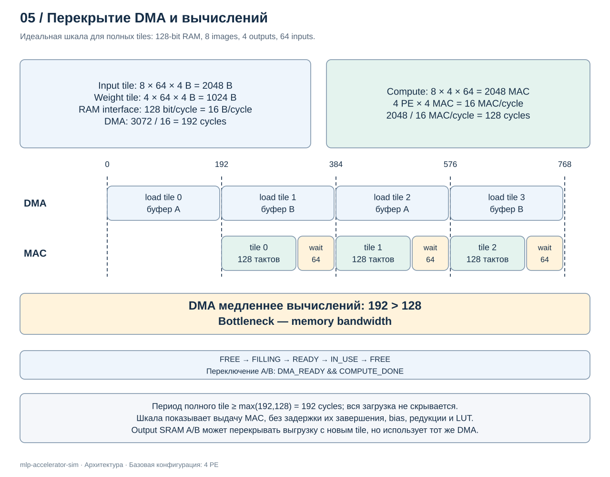
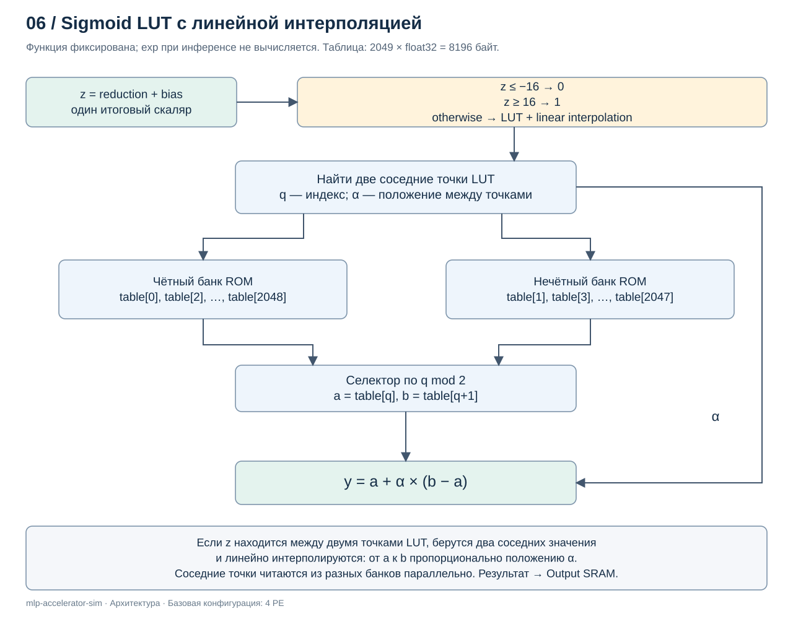
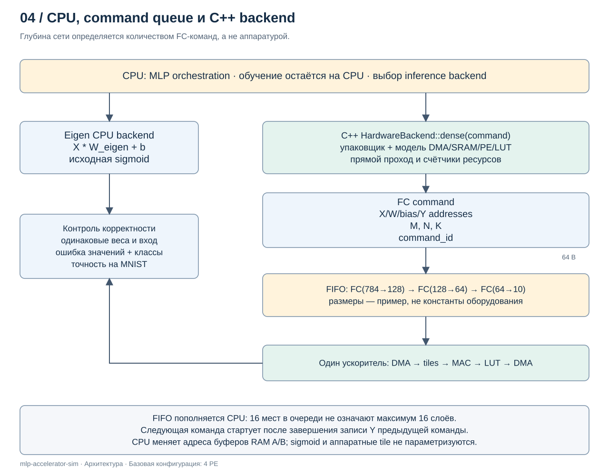

# Архитектура MLP inference accelerator

Ускоритель выполняет полносвязные слои, а CPU управляет сетью и обучением.
Описание включает dataflow, локальную память, packed weights, очередь FC-команд
и sigmoid LUT. Шесть технических схем приведены непосредственно в документе.

## Граница модели

Исходная MLP на Eigen сохранена в `src/mlp/nn.cpp`; симулятор вычисляет
FC с bias и sigmoid LUT для произвольных M/N/K.
Результаты передаются через Output SRAM и DMA в RAM по `y_addr`.
CPU формирует последовательность зависимых FC-команд через `load_mlp()`
и подаёт её в SystemC FIFO на 16 дескрипторов. Для активаций используются
два буфера RAM; количество слоёв не ограничено размером FIFO.
Новая модель работает на уровне логических передач блоков между RAM, DMA,
SRAM, PE, reduction, bias и LUT. Каждая зарегистрированная коммуникационная транзакция
занимает одну единицу model time. При перекрытии подачи CPU и расчёта
суммарное число сообщений может превышать прошедшее время.
MAC-вычисления внутри PE сами по себе
не продвигают model time. Это дискретно-событийная модель без физических
регистров, электрических сигналов и clock edges.

Каркас симуляции — SystemC. RAM, DMA, SRAM, PE, reduction, Bias, SigmoidLUT и Scheduler
оформлены как `sc_module`.
Запуск выполняется через `sc_main` и ядро SystemC. DMA поддерживает загрузку
RAM → DMA → SRAM и выгрузку SRAM → DMA → RAM.
Рабочий `SC_THREAD` FIFO вызывает `Scheduler::execute(command)`.
Планировщик разбивает M на microbatch, обходит выходные и K-плитки,
через DMA получает фрагменты каждой строки X,
распределяет входы в локальные SRAM по `tile_k % pe_count` и вычисляет частичные
суммы каждого PE без продвижения времени. `PEArray` создаёт нужное число
PE через `sc_vector`; каждый PE содержит свои Input SRAM и Weight SRAM.
Число MAC-линий в PE задаётся `output_tile_size`; веса имеют локальный порядок
`[local_k][lane]`. Ёмкость ACC — `microbatch_size × output_tile_size`;
входы имеют локальный порядок `[m][local_k]`. Каждый PE обрабатывает до
`microbatch_size` объектов, переиспользуя один весовой блок.
Веса хранятся в RAM в формате `Wpacked`. DMA загружает полный непрерывный
блок каждого активного PE в его Weight SRAM; передача включает padding.
В PE поступает префикс блока по действительным K; для N передаётся число
действительных MAC-линий. Padding K и N не добавляет полезных MAC.
PE без входов пропускает загрузку входов и весов.
Для каждой пары microbatch/выходная плитка ACC очищаются перед первой K-плиткой
и сохраняются до завершения всех K-плиток. Затем выполняется одна reduction
и добавляется bias, применяется sigmoid LUT; действительные столбцы
передаются через Output SRAM в матрицу Y `[M,N]` во внешней RAM.
Общий модуль Bias хранит одну плитку смещений в буфере ёмкостью
`output_tile_size` FP32-значений. До начала K-плиток DMA загружает
действительные смещения, после reduction Bias принимает блок итоговых сумм
и прибавляет смещения без продвижения времени. Передачи RAM → DMA → Bias
и reduction → Bias учитываются отдельно; bias загружается для каждой
пары microbatch/выходная плитка.
Общий SigmoidLUT принимает блок из Bias через одну транзакцию `BiasToLut`.
Таблица из 2049 FP32-значений создаётся один раз при инициализации.
Чтение соседних узлов ROM и линейная интерполяция выполняются без
продвижения времени. Вызовы обработки пропускают невалидные MAC-линии.
LUT записывает только действительные выходы в общий Output SRAM ёмкостью
`microbatch_size × output_tile_size` FP32-значений. Внутри этого буфера
строки текущей плитки имеют шаг `output_count`. DMA выгружает их по одной
в row-major Y, сохраняя её полный шаг N и учитывая отдельные передачи
SRAM → DMA и DMA → RAM для каждой строки. Передача LUT → Output SRAM
учитывается одним сообщением на плитку. Планировщик завершает FC-команду
после всех записей Y; накопления полного результата внутри него нет.
X загружается заново для каждой выходной плитки, веса — для каждого microbatch.
Последний microbatch содержит только действительные объекты;
ёмкость SRAM и ACC сохраняется. Обмены в текущей демонстрации выполняются
последовательно; Output SRAM содержит один буфер, двойная буферизация
ещё не реализована.
Reduction получает блок частичных сумм от каждого PE, включая нулевые блоки
PE без входов, и объединяет их деревом сложений без продвижения времени.
Один блок PE → reduction учитывается как одна коммуникационная транзакция.
Общий класс `Transactions` учитывает ожидание каждой передачи, число обменов
и объём данных в байтах. Начальная запись входов до запуска симуляции
и просмотр содержимого RAM/SRAM для вывода не учитываются как обмены модели.

Число PE задаётся перед запуском конфигурацией: например, 1, 2, 4 или 8.
Схемы, численные размеры SRAM и аппаратные оценки ниже описывают базовый
пример с четырьмя PE. Формулы раскладки с `4` PE и `16` входами на PE
относятся к этому примеру; функция `pack_weights` учитывает `pe_count`,
`output_tile_size` и `k_tile_size`. Microbatch 8, output tile 4 и K tile 64
заданы именованными параметрами конфигурации.

Оценки в тактах, МГц и микросекундах ниже относятся к аппаратному проекту
и не определяют model time симулятора. Аппаратный показатель загрузки MAC
также не следует переносить в симулятор без определения его метрик.
Гранулярность сообщений, учёт padding, заполнение плиток PE и результаты
экспериментов описаны в [профиле модели](../reports/profiling.md).

## 1. Назначение и программная граница

Ускоритель выполняет одну операцию полносвязного слоя:

$$
Y_{M\times N}=\sigma(X_{M\times K} W_{N\times K}^{T}+b_N).
$$

`M=batch_size`, `K=input_size`, `N=output_size`; sigmoid применяется поэлементно. CPU управляет сетью, данными и очередью команд. Обучение, backward, SGD, loss, загрузка MNIST и вывод в консоль остаются на CPU. В ускоритель не переносится весь класс MLP и не вводится универсальная система инструкций.

**Параметры запуска:** адреса X, W, bias и Y, K, N, M. Размеры положительные, ограничены адресуемой внешней RAM; локальная SRAM хранит только плитки. Тип вычисления и sigmoid фиксированы.

**Число слоёв — свойство программы CPU.** Например, CPU формирует команды `784→128`, `128→64`, `64→10`. Ускоритель не знает общую глубину сети: он извлекает одну команду FC из очереди и исполняет её. Очередь конечной глубины пополняется CPU, поэтому её глубина не ограничивает число слоёв.

Исходная Eigen-реализация `nn.cpp` использует `X * W_eigen`, где `W_eigen` имеет форму `[K,N]`. Функция `pack_weights` читает `W_eigen[k,n]` и записывает значение в аппаратную плитку для выхода n и входа k. Отдельная транспонированная матрица не создаётся. Это изменение представления весов, а не математической операции.

## 2. Общая архитектура



Состав системы:

- **CPU + IO CONTROLLER:** загрузка модели/входов, отправка команд, получение статуса и вывод результатов в консоль.
- **External shared RAM:** общая для CPU и ускорителя память модели, входов и выходов. В ней размещаются модели, входы и результаты.
- **Command queue:** например, FIFO из 16 команд FC, регистры head/tail, start/status, completion/error.
- **DMA + арбитр + распределитель:** общий порт RAM 128 бит; чтение X/W/bias и запись Y используют суммарно одну полосу, а не независимые бесплатные каналы.
- **4 PE:** у каждого локальные banked Input SRAM, Weight SRAM, четыре MAC и отдельные аккумуляторы. Это четыре вычислительных ядра; 16 MAC — арифметические линии внутри них.
- **Reduction → bias → sigmoid LUT → Output SRAM → DMA:** завершение расчёта и вывод результата.

Прямые линии PE–reduction передают частичные суммы, не сохраняя их во внешней памяти. Shared Output SRAM — небольшой общий буфер результатов на кристалле; он не заменяет внешнюю SHARED MEMORY.

## 3. Конкретная микроархитектура и SRAM



| Параметр | Выбор для базового проекта |
|---|---|
| Число PE, P | 4 |
| MAC в одном PE, V | 4, по одному на выходной нейрон плитки |
| Плитка batch, TM | 8 изображений |
| Плитка выходов, TN | 4 нейрона |
| Плитка входов, TK | 64 входа суммарно, 16 на PE |
| Арифметика | FP32; LUT также хранит float32 |
| Внешний DMA | 128 бит = 16 байт/такт в идеальной модели |
| LUT | sigmoid, [-16,16], шаг 1/64, 2049 значений |

В одном PE:

| Хранилище | Размер | Организация |
|---|---:|---|
| Input SRAM A/B | `2×8×16×4 = 1024` байта | Два независимых буфера; чтение одного x и broadcast на 4 MAC |
| Weight SRAM A/B | `2×16×4×4 = 512` байт | Каждый буфер имеет 4 банка по номеру MAC |
| ACC[8][4] | `8×4×4 = 128` байт | 4 независимых банка/регистровых массива, read + write с bypass |
| Weight registers | `4×4 = 16` байт | Четыре веса удерживаются на время прохода по batch |

Всего Input/Weight/ACC — **1664 байта на PE**, 6656 байт на четыре PE. Регистры управления, конвейерные регистры и FIFO учитываются отдельно. Output SRAM A/B — ещё `2×8×4×4=256` байт, bias registers — 16 байт. LUT занимает 8196 байт и является ROM либо загружаемой при инициализации таблицей с фиксированным содержимым.

Weight SRAM: банк `v` выдаёт `w[t,v]`. Четыре банка дают четыре веса параллельно, без конфликта адресов. Вектор входа текущего PE содержит одно значение на текущую пару `(m,t)`, которое используется всеми четырьмя MAC. Во время вычисления из A DMA пишет B; одновременных чтения и записи через один и тот же однопортовый банк не требуется. ACC — отдельное хранилище, не область Weight SRAM.

**Зависимость накопления FP32.** У каждого MAC восемь контекстов ACC по изображениям. Для одного t перебираются изображения m, затем следующий t: повторное обращение к тому же ACC разнесено по времени. При латентности MAC Lmac интервал возврата должен быть не меньше Lmac. В примере принимается Lmac=4, initiation interval=1, `S=max(M_valid,4)` тактов на одну строку весов. При batch 1 используются пустые слоты либо ожидание; нельзя заявлять 16 полезных MAC/такт для любого batch. При другой аппаратной латентности S пересчитывается.

## 4. Tiled layout, weight-stationary и равномерность



Веса хранятся в RAM уже в аппаратном порядке:

```text
Wpacked[n_tile][k_tile][pe][local_k][lane]
n = n_tile*4 + lane
k = k_tile*64 + local_k*4 + pe
Wpacked[...] = W_accel[n,k] при n<N и k<K, иначе 0
```

В модели размеры плиток и число PE берутся из конфигурации:
`n = n_tile*output_tile_size + lane`,
`tile_k = local_k*pe_count + pe`, `k = k_tile*k_tile_size + tile_k`.
Локальная ёмкость равна `ceil(k_tile_size/pe_count)`. При неполных плитках
или `tile_k >= k_tile_size` веса остаются нулевыми. Для числа PE,
не делящего K tile, распределение выполняется по индексу внутри плитки:
`tile_k % pe_count`, с началом отсчёта в каждой K-плитке.
Упаковка выполняется до запуска SystemC. DMA загружает готовые блоки PE
из RAM в локальные Weight SRAM; планировщик обходит microbatch и все
выходные/K-плитки, включая неполные группы и плитки.

Полная плитка весов занимает `4×64×4 = 1024` байта; на PE — 256 байт. Четыре соседних слова — веса для четырёх MAC, а не четыре последовательных шага одного MAC. Адрес линейного слова:

```text
((((n_tile*ceil(K/64)+k_tile)*4+pe)*16+local_k)*4+lane)
```

К адресу W прибавляется это значение, умноженное на четыре байта. Начало W и каждой плитки выровнено по 16 байтам. X и Y остаются обычными непрерывными матрицами row-major `[M,K]` и `[M,N]`; DMA выполняет построчные передачи с известным шагом. Маски скрывают неполные плитки M/N/K; невалидные веса упакованы нулями, невалидные входы формируются локально, невалидные выходы не записываются.

**Dataflow:** загруженная плитка весов остаётся в локальной SRAM, пока обрабатываются до восьми изображений. Для одного local_k четыре веса дополнительно удерживаются в регистрах, пока меняется m. Это weight-stationary на уровне плитки и весовых регистров. Одновременно аккумуляторы сохраняются через все k_tile — частичные результаты не уходят в RAM.

Каждый PE отвечает за входы `k mod 4 = pe`, все PE участвуют в каждой выходной плитке. Поэтому N=10 не создаёт разной работы четырёх ядер: у всех одинаково недозагружены две MAC-линии последней плитки. Если K не делится на 4, число полезных входов отличается максимум на один на нейрон; физическое расписание одинаково, но операции над дополнением нельзя считать полезной нагрузкой.

Вес переиспользуется **до восьми раз за загрузку**, а не обязательно M раз. При M=32 базовый порядок циклов загружает веса четырежды, по одному разу на микробатч. Перестановка циклов для однократной загрузки весов на весь произвольный batch потребовала бы большего ACC-хранилища либо обмена частичными суммами с RAM.

## 5. Алгоритм одной FC-команды

```text
for m0 in range(0, M, 8):
    Mv = min(8, M-m0)
    for n0 in range(0, N, 4):
        Nv = min(4, N-n0)
        clear ACC[pe][m][lane] на всех PE
        загрузить bias[n0:n0+Nv]
        загрузить первые Input/Weight tiles в A
        for k0 in range(0, K, 64):
            параллельно:
                DMA готовит следующую k-плитку в свободных X/W буферах
                все PE вычисляют текущую плитку:
                    for t in range(16):
                        weight_reg[0:4] = WeightSRAM[t,0:4]
                        for slot in range(max(Mv,Lmac)):
                            если slot < Mv:
                                ACC[slot,0:4] += X_local[slot,t]*weight_reg[0:4]
            дождаться DMA_READY и COMPUTE_DONE, поменять A/B
        для каждой действительной пары (m,lane):
            s = (ACC_PE0 + ACC_PE1) + (ACC_PE2 + ACC_PE3)
            y = sigmoid_LUT(s + bias[lane])
            записать y в Output SRAM
        DMA записывает действительный прямоугольник Y[m0:m0+Mv,n0:n0+Nv]
после завершения всех записей выдать completion
```

Редукция и sigmoid выполняются **после всех k_tile**, bias добавляется один раз. К каждой частичной сумме sigmoid применять нельзя. Переход A/B при последней k-плитке не запускает чтение за границей K.

Для первого backend допустимо ждать выгрузки Output SRAM перед следующей выходной плиткой. В режиме перекрытия два выходных буфера позволяют выгружать предыдущий результат во время следующего вычисления. Арбитр DMA учитывает эту запись в общей полосе, а занятый буфер удерживается до `DMA_DONE`.

## 6. Double buffering и перекрытие



У X и W свои пары A/B. Их состояния: `FREE → FILLING → READY → IN_USE → FREE`. Чтение начинается только после READY, перезапись — после завершения использования. Одних двух указателей без проверки готовности недостаточно.

Для полной плитки Mv=8:

```text
X: 8×64×4 = 2048 байт
W: 4×64×4 = 1024 байта
DMA load: (2048+1024)/16 = 192 такта
MAC issue: 16 local_k × 8 изображений = 128 тактов
```

После первоначального заполнения время шага примерно `max(Tload,Tcompute)`, плюс согласование и незакрытые задержки. При 128-битном DMA вычислители ждут не менее 64 тактов на полной плитке в идеальной модели issue; double buffering скрывает часть передачи, но не устраняет дефицит полосы. 256-битный DMA уменьшил бы идеальную передачу до 96 тактов, однако потребовал бы соответствующей скорости записи SRAM — это отдельное расширение, не характеристика базового проекта.

Три вида A/B не следует смешивать: локальные буферы X/W перекрывают DMA и MAC; Output SRAM A/B перекрывает выдачу результатов и следующую плитку; два больших буфера в RAM переиспользуются CPU между слоями сменой адресов.

## 7. Sigmoid LUT с интерполяцией



Фиксированная функция: `sigma(z)=1/(1+exp(-z))`. Во время инференса exp не вычисляется. Таблица создаётся заранее:

```text
table[i] = sigmoid(-16+i/64), i=0…2048
z ≤ -16: y=0
z ≥  16: y=1
иначе:
    u=(z+16)*64
    q=min(2047,floor(u)), alpha=u-q
    y=table[q]+alpha*(table[q+1]-table[q])
```

Два соседних значения читаются параллельно из банков чётных и нечётных индексов; селектор восстанавливает их порядок. Так не требуется двух чтений одного однопортового банка за такт. Ограничение q защищает адрес q+1, если FP32 округлит u до 2048 вблизи верхней границы. NaN распространяется как NaN; бесконечности насыщаются в 0/1.

Линейная интерполяция входит в выбранный базовый проект и не является полем команды.

Аналитическая погрешность интерполяции без округления FP32 внутри диапазона ограничена `h² max|sigma''|/8`, где `h=1/64`, `max|sigma''|=sqrt(3)/18`: менее `2,94×10⁻⁶`. Ошибка насыщения на границе — менее `1,13×10⁻⁷`. Ошибки накопления и округления считаются отдельно. Изменение итогового класса нельзя исключить только по локальной оценке LUT.

## 8. Очередь команд и C++ backend



Аппаратный дескриптор команды фиксированного размера 64 байта:

| Поля | Размер |
|---|---:|
| x_addr, w_addr, bias_addr, y_addr | 4×uint64 = 32 байта |
| input_size, output_size, batch_size, command_id | 4×uint32 = 16 байт |
| reserved, заполнено нулями | 16 байт |

В C++ модели `FCCommand` хранит логические поля `m/n/k` и четыре адреса.
Размер C++ структуры не задаёт размер аппаратного дескриптора. `command_id`,
резервные поля и сериализация дескриптора сейчас не реализуются.

Данные — float32, little-endian. Активация, размеры аппаратных плиток и формат W определены версией устройства. Базовые адреса выровнены по 16 байтам, внутренние строки X/Y могут начинаться с 4-байтным выравниванием: DMA использует маски крайних слов. Загрузчик проверяет положительные размеры, переполнения произведений, доступность областей и отсутствие опасного перекрытия X/Y/W.

CPU пишет дескриптор, затем публикует tail/doorbell. Очередь исполняется по порядку. Следующая FC-команда начинается после завершения **записи** предыдущей, поэтому межслойная зависимость не требует отдельного планировщика. Программный интерфейс задаёт видимость памяти; для реального устройства с некогерентным DMA драйверу потребуются соответствующие операции синхронизации.

Для сети произвольной глубины CPU чередует два достаточно больших буфера RAM A/B и выставляет следующий `x_addr` равным предыдущему `y_addr`. Это устраняет дополнительную копию в RAM, но не обязательную передачу RAM→Input SRAM следующего слоя. Хранение промежуточного слоя целиком на кристалле можно добавить позже; базовая схема этого не обещает.

План программной структуры модели:

```text
MLP orchestration / CPU
    ├── Исходный Eigen backend: X * W_eigen + b → sigmoid
    └── HardwareBackend::dense(command)
           ├── packed weights / DMA / SRAM
           ├── PE + ACC + reduction
           └── LUT sigmoid / communication counters
```

Существующий Eigen backend сохраняет обучение и CPU-инференс. Новый C++ backend реализует прямой проход FC и модель аппаратных ресурсов. Топологию сети обходит CPU-обвязка. Симулятор запускается на CPU и собирает статистику коммуникаций спроектированного ускорителя; скорость выполнения этой C++ программы не является скоростью аппаратного устройства.

## 9. Оценка времени и загрузки PE

Здесь даны воспроизводимые нижние оценки, а не фиктивное точное время без модели арбитража. Начальная загрузка модели с диска в RAM и вывод консоли не учитываются.

Пусть `Gm=ceil(M/8)`, `Gn=ceil(N/4)`, `Gk=ceil(K/64)`, `Kp=64Gk`, `Np=4Gn`. Весовые плитки хранятся с дополнением, X/Y передаются только для действительных элементов. При отсутствии дополнительного кэша и сохранения X между выходными плитками:

```text
Полезные MAC = M*K*N
Tissue = Gn*Gk*16 * sum(max(Mv, Lmac)) по микробатчам
Dweights = 4*Gm*Np*Kp
Dinput   = 4*M*K*Gn
Dbias    = 4*N*Gm
Doutput  = 4*M*N
Tdma ≥ ceil((Dweights+Dinput+Dbias+Doutput)/16)
Tlayer ≥ max(Tissue,Tdma)
```

Узкие построчные передачи и невыровненные края могут занять больше тактов, чем округление суммарного числа байт. Реальное T включает также заполнение/опустошение конвейера, ACC clear, выбор команд, задержки RAM и DMA, редукцию и sigmoid. Нижняя оценка не означает, что эти фазы полностью перекрываются.

Для примера сети `784→128→10`, Lmac=4:

| Batch | Полезные MAC всей сети | Tissue, сумма слоёв | Трафик RAM, байт | Нижняя оценка T сети |
|---:|---:|---:|---:|---:|
| 1 | 101 632 | 27 008 | 535 120 | ≥33 445 тактов |
| 32 | 3 252 224 | 216 064 | 5 008 800 | ≥313 050 тактов |

При условных 100 МГц это не менее 334,45 мкс для batch 1 и 3,1305 мс для batch 32, то есть не менее 97,83 мкс на изображение в batch 32. Это нижняя граница задержки выбранной модели, а не измеренный результат или обещание аппаратной частоты.

Каждый PE выполняет 25 408 полезных MAC при M=1 и 813 056 при M=32: по 25% работы. Полезная загрузка арифметических линий ядра:

```text
Upe = useful_MAC_pe / (4 * Tnetwork)
```

Из нижних оценок T следуют только **верхние границы** полезной загрузки: около 19,0% при batch 1 и 64,9% при batch 32. Фактические одинаковые загрузки четырёх PE определяются измеренными счётчиками модели. Отдельно следует вывести MAC_valid, MAC_masked, cycles_wait_dma и cycles_wait_output; занятость PE и использование всех его MAC — разные метрики.

Эти оценки заменяют расчёты прошлой схемы с одним MAC на PE. SRAM и reuse уменьшают трафик, но базовое расписание повторно загружает X для каждой выходной плитки и W для каждого микробатча. Это осознанный компромисс малой локальной памяти; глобальная минимальность RAM-трафика не заявляется.

## 10. Контекст

Использование локальной памяти для повторного использования весов и входов,
batch reuse и отдельного LUT-блока описано в
[архитектуре NVDLA](https://nvdla.org/hw/v1/hwarch.html).
Конфигурация PE, размеры плиток, очередь и расчёты этого проекта описаны выше.
